# ReceiptTracker Architecture Documentation

## Architecture Diagrams

### Production Environment - Google Cloud

```mermaid
graph TB
    subgraph "Users & Clients"
        AndroidApp["📱 Android App<br/>(Play Store)"]
        iOSApp["📱 iOS App<br/>(App Store )"]
        WebApp["🌐 Web client"]
    end
    
    subgraph "Google Cloud Platform"
        subgraph "Cloud Run Services"
            FrontendProd["🖥️ Frontend Container<br/>(Nginx)<br/>Port: 80"]
            BackendProd["⚙️ Backend Container<br/>(Gunicorn)<br/>Port: 8000"]
        end
        
        CloudSQL["🗄️ Cloud SQL<br/>(PostgreSQL)<br/>Production Database"]
        
        subgraph "Storage"
            CloudStorage["☁️ Cloud Storage<br/>(Profile Pictures,<br/>Receipt Images,<br/>RSA Keys)"]
        end
    end
    
    subgraph "AI Services"
        OpenAI["🤖 OpenAI API<br/>(Receipt Processing)"]
    end
    
    %% Production connections
    AndroidApp <--> BackendProd
    iOSApp <--> BackendProd
    WebApp <--> FrontendProd
    WebApp <--> BackendProd
    BackendProd <--> CloudSQL
    BackendProd <--> CloudStorage
    BackendProd <--> OpenAI
    
    %% Styling
    classDef prodContainer fill:#e1f5fe,stroke:#01579b,stroke-width:2px,color:#000
    classDef database fill:#fff3e0,stroke:#e65100,stroke-width:2px,color:#000
    classDef storage fill:#e8f5e8,stroke:#2e7d32,stroke-width:2px,color:#000
    classDef client fill:#fce4ec,stroke:#c2185b,stroke-width:2px,color:#000
    classDef ai fill:#fff8e1,stroke:#f57f17,stroke-width:2px,color:#000
    
    class FrontendProd,BackendProd prodContainer
    class CloudSQL database
    class CloudStorage storage
    class AndroidApp,iOSApp,WebApp client
    class OpenAI ai
```

### Development Environment - Local Docker

```mermaid
graph TB
    subgraph "Development Clients"
        DevWebApp["🌐 Development Web<br/>(localhost)"]
        DevMobileApp["📱 Mobile Dev<br/>(localhost:8000)"]
    end
    
    subgraph "Docker Environment"
        subgraph "Docker Network: receipt-tracker-network"
            FrontendDev["🖥️ Frontend Container<br/>(Nginx)<br/>(receipt-tracker-frontend)<br/>Port: 80"]
            BackendDev["⚙️ Backend Container<br/>(Gunicorn)<br/>(receipt-tracker-backend)<br/>Port: 8000"]
            PostgresDev["🗄️ PostgreSQL Container<br/>(PostgreSQL 17)<br/>(receipt-tracker-postgres)<br/>Port: 5432"]
        end
        
        subgraph "Local Volumes"
            ProfilePics["📁 Profile Pictures<br/>(./backend/profile_pics)"]
            ReceiptImages["📁 Receipt Images<br/>(./backend/receipt_images)"]
            RSAKeys["🔐 RSA Keys<br/>(./backend/keys)"]
            PostgresData["💾 PostgreSQL Data<br/>(postgres_data)"]
        end
    end
    
    subgraph "AI Services"
        OpenAIDev["🤖 OpenAI API<br/>(Receipt Processing)"]
    end
    
    %% Development connections
    DevWebApp <--> FrontendDev
    DevWebApp <--> BackendDev
    DevMobileApp <--> BackendDev
    BackendDev <--> PostgresDev
    BackendDev <--> ProfilePics
    BackendDev <--> ReceiptImages
    BackendDev <--> RSAKeys
    PostgresDev <--> PostgresData
    BackendDev <--> OpenAIDev
    
    %% Styling
    classDef devContainer fill:#f3e5f5,stroke:#4a148c,stroke-width:2px,color:#000
    classDef database fill:#fff3e0,stroke:#e65100,stroke-width:2px,color:#000
    classDef storage fill:#e8f5e8,stroke:#2e7d32,stroke-width:2px,color:#000
    classDef client fill:#fce4ec,stroke:#c2185b,stroke-width:2px,color:#000
    classDef ai fill:#fff8e1,stroke:#f57f17,stroke-width:2px,color:#000
    
    class FrontendDev,BackendDev devContainer
    class PostgresDev database
    class ProfilePics,ReceiptImages,RSAKeys,PostgresData storage
    class DevWebApp,DevMobileApp client
    class OpenAIDev ai
```

### Production Environment (Google Cloud)

#### Client Applications
- **Android App**: Mobile app available on Play Store (direct backend API communication)
- **iOS App**: Mobile app available on App Store (direct backend API communication)
- **Web client**: Web interface running in browser (static files)

#### Google Cloud Platform Services
- **Frontend Container (Cloud Run)**: Nginx web server with Angular/Ionic static files, port 80
- **Backend Container (Cloud Run)**: Gunicorn WSGI server with FastAPI app, port 8000
  - Multi-process deployment (4 workers)
  - Uvicorn workers (ASGI compatibility)
  - Production-ready configuration
- **Cloud SQL**: PostgreSQL database
- **Cloud Storage**: File storage (profile pictures, receipt images, RSA keys)
- **Secret manager**: Storage for passwords, API keys

### Development Environment (Local Docker)

#### Docker Containers
- **Frontend Container**: Nginx web server port 80
- **Backend Container**: Gunicorn WSGI server, port 8000
  - 4 worker processes (configurable)
  - Uvicorn worker class for ASGI support
- **PostgreSQL Container**: PostgreSQL 17 Alpine database, port 5432

#### Persistence volumes
- **Profile Pictures**: `./backend/profile_pics`
- **Receipt Images**: `./backend/receipt_images`
- **RSA Keys**: `./backend/keys`
- **PostgreSQL Data**: `postgres_data` volume

### External Services
- **OpenAI API**: Automatic processing and analysis of receipts with AI

## Scalability

### Cloud Run Automatic Scaling

Google Cloud Run is a **serverless container platform** that automatically manages application scaling based on incoming requests.

#### **Scaling Mechanism**
- **Request-based scaling**: Decides to start new instances based on each incoming HTTP request
- **Instant scaling**: Can scale from 0 to hundreds of parallel instances in seconds
- **Scale-to-zero**: Automatically scales down to 0 instances when idle (cost optimization)
- **Maximum concurrency**: Configurable number of parallel requests per instance (default: 1000)

#### **Performance and Optimization**
- **Cold start**: ~1-3 seconds startup time for the first request
- **Warm instances**: Active instances respond instantly
- **Keep-alive**: Maintain minimum instances to avoid cold start
- **Traffic allocation**: Gradual traffic redirection to new versions

#### **Resource Management**
- **CPU allocation**:
  - Default: 1 vCPU
  - Scalable: 1-8 vCPU
  - CPU throttling during request processing
- **Memory allocation**:
  - Range: 128MB - 32GB
  - Automatic garbage collection

#### **Cost Optimization**
- **Pay-per-use**: Pay only for actual CPU and memory usage
- **No idle charges**: 0 cost when idle
- **Request-based billing**: Measured in 100ms intervals

### Additional Scalability Factors

- **Cloud SQL**:
  - Automatic connection pooling
  - Read replicas for high read load
  - Automatic backup and point-in-time recovery
  - High availability configuration

- **Cloud Storage**:
  - Unlimited storage (parallel upload/download)
  - Global CDN integration
  - Multi-region redundancy
  - Automatic data encryption

- **Container-based architecture**:
  - Horizontal scaling (multiple instances)
  - Stateless design

#### **Monitoring and Performance**

Metrics:
- Request count/sec
- Request latency (P50, P95, P99)
- Instance count (active/idle)
- Error rate (4xx, 5xx)
- Memory/CPU utilization

## JWT Authentication

### Overview
ReceiptTracker uses **RSA256-based JWT (JSON Web Token)** authentication, ensuring secure user authentication and authorization management.

### Technical Implementation

#### **Token Types**
- **Access Token**: Short-lived (60 minutes), for API access
- **Refresh Token**: Long-lived (7 days), for renewing access tokens

#### **RSA256 Encryption**
- **Private key**: For signing tokens
- **Public key**: For validating tokens
- **Key location**: `backend/keys/` folder

#### **Token Security**
- **RSA256**: Asymmetric encryption
- **Token rotation**: Automatic refresh token replacement
- **Database storage**: Refresh tokens are tracked in the database
- **Automatic expiration**: Access token 60 minutes, refresh token 7 days

### Role-Based Access Control (RBAC)

#### **Roles**
- **admin**: Full system access
  - Register users
  - View user list
  - Access all features
- **user**: Basic user rights
  - Manage own receipts
  - View own statistics
  - Edit profile

## Data Model Diagram

### Database Schema (Entity Relationship Diagram)

### Data Model Relationships

#### **User System**
- **User ↔ Role**: Many-to-many relationship (UserRoleLink table)
  - A user can have multiple roles
  - A role can be assigned to multiple users
- **User → RefreshToken**: One-to-many relationship
  - A user can have multiple active refresh tokens

#### **Receipt System**
- **User → Receipt**: One-to-many relationship
  - A user can upload multiple receipts
  - Each receipt belongs to exactly one user
- **Market → Receipt**: One-to-many relationship
  - Multiple receipts can come from one store
  - Each receipt belongs to exactly one store
- **Receipt → ReceiptItem**: One-to-many relationship
  - A receipt can contain multiple items
  - Each item belongs to exactly one receipt

### Data Types and Constraints

#### **Database Tables**
- **Users table**: User data + authentication
- **Roles table**: Role definitions (admin, user)
- **UserRoleLink table**: Many-to-many relationship between users and roles
- **RefreshTokens table**: JWT refresh token registry
- **Markets table**: Store basic data
- **Receipts table**: Main receipt data + file references
- **ReceiptItems table**: Details of items on receipts 