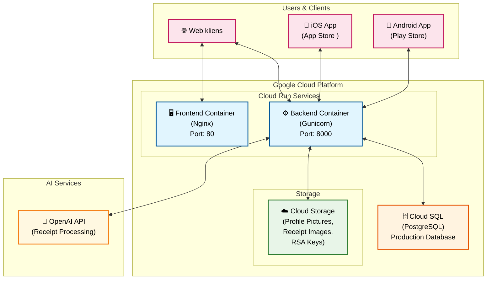
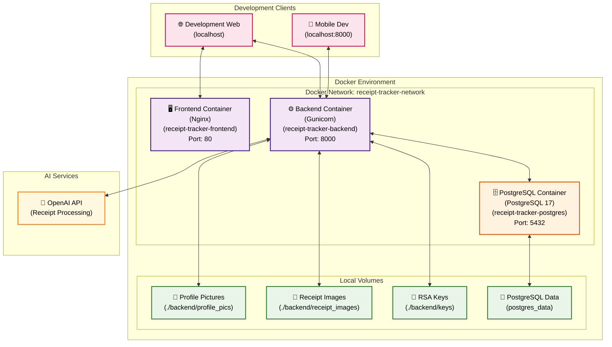
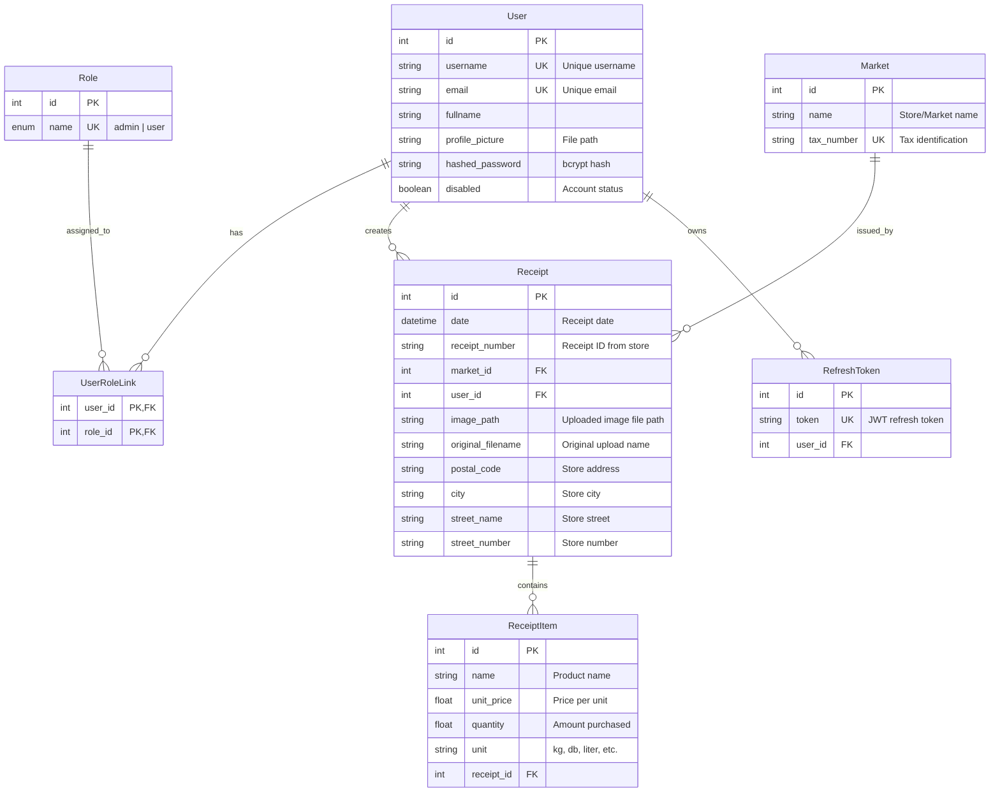

# ReceiptTracker Architektúra Dokumentáció

## Architektúra Ábrák

### Éles Környezet - Google Cloud

### Fejlesztési Környezet - Local Docker

## Leírások

### Éles Környezet (Google Cloud)

#### Kliens Alkalmazások
- **Android App**: Play Store-ban elérhető mobil alkalmazás (közvetlen backend API kommunikáció)
- **iOS App**: App Store-ban elérhető mobil alkalmazás (közvetlen backend API kommunikáció)
- **Web kliens**: Böngészőben futó webes felület (statikus fájlok + közvetlen API hívások)

#### Google Cloud Platform Szolgáltatások
- **Frontend Container (Cloud Run)**: Nginx web szerver Angular/Ionic statikus fájlokkal, port 80
- **Backend Container (Cloud Run)**: Gunicorn WSGI szerver FastAPI alkalmazással, port 8000
  - Multi-process deployment (4 worker)
  - Uvicorn workers (ASGI kompatibilitás)
  - Production-ready konfigurációval
- **Cloud SQL**: Felügyelt PostgreSQL adatbázis
- **Cloud Storage**: Fájlok tárolása (profilképek, blokkképek, RSA kulcsok)

### Fejlesztési Környezet (Local Docker)

#### Docker Konténerek
- **Frontend Container**: Nginx web szerver port 80
- **Backend Container**: Gunicorn WSGI szerver, port 8000
  - 4 worker process (konfigurálható)
  - Uvicorn worker class ASGI támogatáshoz
  - Hot reload fejlesztés során
- **PostgreSQL Container**: PostgreSQL 17 Alpine adatbázis, port 5432

#### Persistence volumes
- **Profile Pictures**: `./backend/profile_pics`
- **Receipt Images**: `./backend/receipt_images`
- **RSA Keys**: `./backend/keys`
- **PostgreSQL Data**: `postgres_data` volume

### Külső Szolgáltatások
- **OpenAI API**: Blokkok automatikus feldolgozása és elemzése AI segítségével

## Skalázhatóság

### Cloud Run Automatikus Skálázás

A Google Cloud Run egy **szerver nélküli (serverless)** konténer platform, amely automatikusan kezeli az alkalmazás skálázását a beérkező kérések alapján.

#### **Skálázási Mechanizmus**
- **Request-based scaling**: Minden bejövő HTTP kérés alapján dönt az új instance-ok indításáról
- **Instant scaling**: 0-ról akár több száz párhuzamos instance-ra skálázhat másodpercek alatt
- **Scale-to-zero**: Nulla forgalom esetén automatikusan 0 instance-ra csökken (költségoptimalizálás)
- **Maximum concurrency**: Instance-onként beállítható párhuzamos kérések száma (alapértelmezett: 1000)

#### **Performance és Optimalizálás**
- **Cold start**: Első kérés esetén ~1-3 másodperc indítási idő
- **Warm instances**: Aktív instance-ok azonnal válaszolnak
- **Keep-alive**: Minimum instance-ok fenntartása a cold start elkerülésére
- **Traffic allocation**: Fokozatos forgalom átirányítás új verziókra

#### **Resource Management**
- **CPU allocation**: 
  - Alapértelmezett: 1 vCPU
  - Skálázható: 1-8 vCPU között
  - CPU throttling request feldolgozás közben
- **Memory allocation**:
  - Tartomány: 128MB - 32GB
  - Automatikus garbage collection

#### **Cost Optimization**
- **Pay-per-use**: Csak a tényleges CPU és memory használatért fizetsz
- **No idle charges**: Inaktív időben 0 költség
- **Request-based billing**: 100ms-os időkeretekben mérve

### További Skálázhatósági Tényezők

- **Cloud SQL**: 
  - Automatikus connection pooling
  - Read replica-k nagy olvasási terheléshez
  - Automatic backup és point-in-time recovery
  - High availability konfiguráció

- **Cloud Storage**: 
  - Korlátlan tárhely (parallel upload/download)
  - Global CDN integráció
  - Multi-region redundancia
  - Automatic data encryption

- **Konténer alapú architektúra**: 
  - Horizontal scaling (több instance)
  - Stateless design

#### **Monitoring és Teljesítmény**

Metrics:
- Request count/sec
- Request latency (P50, P95, P99)
- Instance count (active/idle)
- Error rate (4xx, 5xx)
- Memory/CPU utilization

## JWT Authentikáció

### Áttekintés
A ReceiptTracker **RSA256 alapú JWT (JSON Web Token)** authentikációt használ, amely biztosítja a biztonságos felhasználói hitelesítést és jogosultság-kezelést.

### Technikai Implementáció

#### **Token Típusok**
- **Access Token**: Rövid életciklusú (60 perc), API hozzáféréshez
- **Refresh Token**: Hosszú életciklusú (7 nap), access token megújításához

#### **RSA256 Titkosítás**
- **Privát kulcs**: Token aláírásához
- **Publikus kulcs**: Token validálásához 
- **Kulcsok helye**: `backend/keys/` mappa

#### **Token Biztonság**
- **RSA256**: Aszimmetrikus titkosítás
- **Token rotation**: Refresh token automatikus cseréje
- **Adatbázis tárolás**: Refresh token-ek nyilvántartása
- **Automatikus lejárat**: Access token 60 perc, refresh token 7 nap

### Role-Based Access Control (RBAC)

#### **Szerepkörök**
- **admin**: Teljes rendszer hozzáférés
  - Felhasználók regisztrálása
  - Felhasználói lista megtekintése
  - Összes funkció elérhető
- **user**: Alap felhasználói jogok
  - Saját blokkok kezelése
  - Saját statisztikák megtekintése
  - Profil szerkesztése

## Adatmodell Diagram

### Adatbázis Séma (Entity Relationship Diagram)

### Adatmodell Kapcsolatok

#### **Felhasználói Rendszer**
- **User ↔ Role**: Több a többhöz kapcsolat (UserRoleLink tábla)
  - Egy felhasználónak több szerepköre lehet
  - Egy szerepkört több felhasználó is birtokolhat
- **User → RefreshToken**: Egy a többhöz kapcsolat
  - Egy felhasználónak több aktív refresh token-je lehet

#### **Blokk Rendszer**
- **User → Receipt**: Egy-több kapcsolat
  - Egy felhasználó több blokkot tölthet fel
  - Minden blokk pontosan egy felhasználóhoz tartozik
- **Market → Receipt**: Egy-sok kapcsolat
  - Egy áruházból több blokk származhat
  - Minden blokk pontosan egy áruházhoz tartozik
- **Receipt → ReceiptItem**: Egy-sok kapcsolat
  - Egy blokkon több termék szerepelhet
  - Minden termék pontosan egy blokkhoz tartozik

### Adattípusok és Megkötések

#### **Adatbázis Táblák**
- **Users tábla**: Felhasználói adatok + authentikáció
- **Roles tábla**: Szerepkör definíciók (admin, user)
- **UserRoleLink tábla**: Több-több kapcsolat felhasználók és szerepkörök között
- **RefreshTokens tábla**: JWT refresh token-ek nyilvántartása
- **Markets tábla**: Áruházak alapadatai
- **Receipts tábla**: Blokk fő adatok + fájl referenciák
- **ReceiptItems tábla**: Blokkon szereplő termékek részletei
